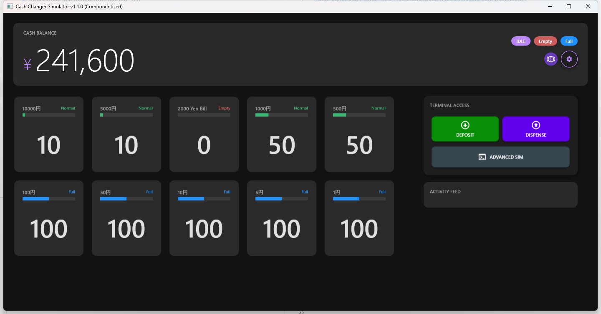
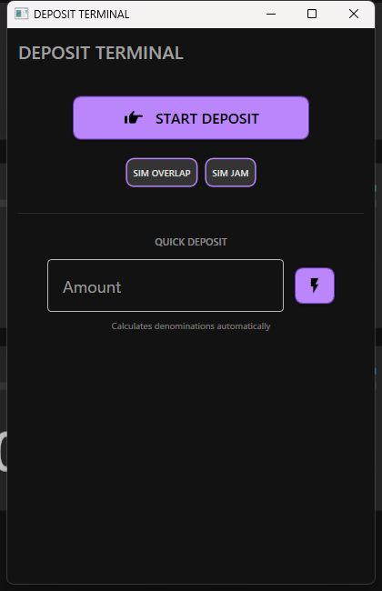
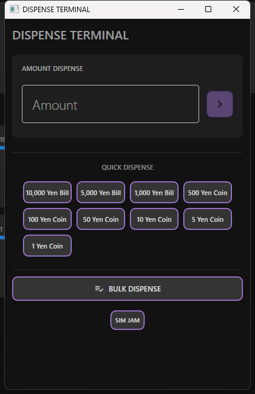

# Standard Mode Operating Instructions

Standard Mode is designed for direct manual interaction with the simulated device via the GUI.

## 1. Screen Layout

- **Inventory Screen**: Displays current denomination counts.
- **Deposit/Dispense Screen**: Perform manual deposit and dispense simulations.
- **Activity Feed**: A chronological list of device events (e.g., DataEvent, StatusUpdateEvent).

*Fig: Simulator Main Dashboard*

## 2. Inventory Management

1. **Initial State**: Inventory is initialized based on `config.toml` at startup.
2. **Manual Updates**: You can directly edit machine counts in the Inventory tab and click "Save" or "Apply" to update the simulator's logic immediately.
3. **Discrepancy Toggle**: Use the "Set Discrepancy" option in the simulation menu to simulate an inventory mismatch state.

## 3. Manual Deposit (Deposit)

1. Select the `Deposit` tab.
2. Click "Begin Deposit".
3. Select numbers or input counts, then click "Insert Cash" to feed the device.
4. Click "End Deposit" to finalize; change will be dispensed if applicable.

## 4. Manual Dispense (Dispense)

1. Select the `Dispense` tab.
2. **Amount Dispense (`DispenseChange`)**: Enter the total amount and click "Execute". The system automatically calculates the best denomination combination.
3. **Inventory Dispense (`DispenseCash`)**: Input specific counts for each denomination and click "Dispense Cash".

## 5. Log Monitoring

- Real-time behavior is visible in the **Activity Feed**.
- Detailed technical logs are stored in the `logs/` directory of the application's root folder.

---
*For the Japanese version, see [ApplicationOperatingInstructions_JP.md](ApplicationOperatingInstructions_JP.md).*
