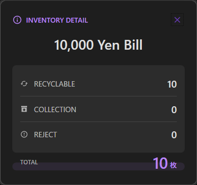
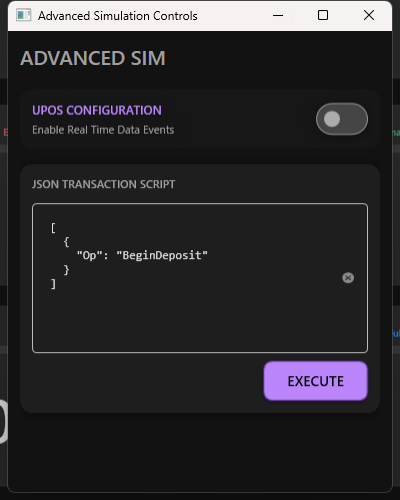

# 標準モード操作説明書 (Application Operating Instructions)

標準モードは、デバイス単体としての機能を GUI から直接操作・確認するためのモードです。直感的なインターフェースにより、在庫状態の監視や入出金シナリオのテストが可能です。

## 1. 画面構成

- **在庫タイル (Inventory Grid)**: 各金種の現在枚数と状態（Connected, Discrepancy, NearFull等）をリアルタイムに表示します。
- **コントロールパネル- **入出金制御 (右パネル)**:
  - **Terminal Access**: 入金・出金シミュレーションウィンドウを起動します。
  - **Advanced Simulation**: スクリプト実行やエラー注入などの高度なツールを起動します。
  - **Device Control**: `Open` / `Close` ボタンによるライフサイクル管理。
- **アクティビティフィード**: デバイスイベント（DataEvent, StatusUpdateEvent等）の履歴。

*図: メインダッシュボード*

## 2. デバイス制御とライフサイクル

1. **Open**: シミュレータを初期化し、上位アプリケーション（外部または内蔵ツール）から利用可能にします。
2. **Close**: デバイスを停止し、リソースを解放して初期状態に戻ります。

## 3. 入出金シミュレーション

### 手動入金 (Deposit)

1. `Deposit` ボタンをクリックして専用ウィンドウを開きます。
2. 金種ごとのボタンをクリックして現金を「投入」します。
3. `Fix` ボタンで投入内容を確定（バリデーション）します。
4. `End` ボタンで取引を完了させ、在庫に反映します。

### 手動出金 (Dispense)

1. `Dispense` ボタンをクリックして専用ウィンドウを開きます。
2. 合計金額を入力、または直接金種枚数を指定して出金を実行します。

## 4. 在庫管理と詳細表示

### 在庫タイルの見方
- **色とアイコン**: `Connected` (接続中), `Discrepancy` (在庫不一致), `NearFull` などの状態がアイコンと背景色で表現されます。
- **視認性**: フォントサイズとコントラストを最適化し、遠目からでも状態を把握しやすくなっています。

### 金種詳細ダイアログ
在庫タイルをクリックすると、**金種詳細ダイアログ**が表示されます。
- **Recycle**: 払い出しに利用可能な枚数。
- **Collection**: あふれ等で自動回収された枚数。
- **Reject**: 汚れや破損等でリジェクトされた枚数。

*図: 金種詳細ダイアログ*

## 5. 高度なシミュレーション (Advanced Simulation)

このウィンドウでは、通常のUI操作では再現が困難なシナリオをテストできます。
- **スクリプト実行**: キャッシュトランザクションの連続操作を定義したJSONファイルを順次実行します。
- **エラー注入**: `NearFull` や `Full` などのセンサーエラーを強制的に発生させ、上位アプリの挙動を確認できます。

## 6. 設定ファイル (config.toml)

アプリケーション実行ディレクトリの `config.toml` を編集することで、初期在庫やしきい値をカスタマイズできます。

### `[System]` — システム全般
- `CurrencyCode`: 使用通貨（デフォルト "JPY"）
- `UIMode`: UI起動モード（Standard/PosTransaction）

### `[Inventory.<CODE>.Denominations.<KEY>]` — 金種別設定
- `InitialCount`: 起動時の枚数
- `NearEmpty` / `NearFull` / `Full`: 各状態の判定しきい値

---
*英語版については、[ApplicationOperatingInstructions.md](ApplicationOperatingInstructions.md) を参照してください。*
