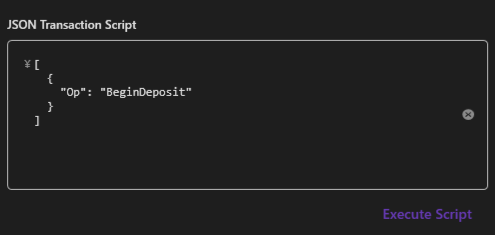

# POSモード操作説明書 (POS Mode Operating Instructions)

POSモードは、外部のPOSアプリケーションからの制御をシミュレートし、連携テストや異常系シナリオ（エラーハンドリング）の検証を行うためのモードです。

## 1. POS ライフサイクルのシミュレーション

シミュレーターの UI 上にある「Advanced Simulation」または「POS State」セクションから、以下の状態を擬似的に発生させることができます。

- **Connected/Disconnected**: デバイスの装着・取り外しイベントの発生。
- **Claim/Release**: アプリケーションによる占有状態の切り替え。

## 2. 異常系シナリオの実行

外部アプリとの通信エラーや物理的な故障をシミュレートするために、以下のコントロールを使用します。

### メカニカルジャム (Jam)

- 「Simulate Jam」をONにすると、デバイスがジャム状態となります。
- この状態で払出や入金などのメソッドを呼び出すと、UPOS 標準の `ErrorCode.Failure` が返されます。

### 在庫不足 (OverDispense)

- 特定の金種を 0 に設定した状態で、その金種を要求する払出処理を実行すると、`UposCashChangerErrorCodeExtended.OverDispense` (201) が発生します。

## 3. スクリプトによる自動実行

*図：JSON スクリプトによる自動実行セクション*

JSON 形式のスクリプトファイルを読み込むことで、連続した操作シナリオ（例：入金 → 確定 → 払出 → ジャム発生）を自動的に実行できます。

1. `Scripts` タブを選択します。
2. JSON ファイルをロードします。
3. 「Run Script」をクリックして実行を開始します。実行状況はログウィンドウに逐次表示されます。

## 4. リアルタイム通知の検証

- `RealTimeDataEnabled` プロパティを ON に設定することで、入金中の各金種投入ごとに `DataEvent` が発生する挙動をテストできます。
- POSアプリ側で中途の入金額を即座に表示したい場合の動作検証に有効です。

## 5. DirectIO による特殊操作

外部 POS アプリから `DirectIO` メソッドを通じて、本シミュレーター独自のコマンド（例：文字列による在庫の一括調整）を発行できます。
詳細は [UPOS Compliance Mapping](UposComplianceMapping_JP.md) を参照してください。

---
*英語版については、[PosModeApplicationOperatingInstructions.md](PosModeApplicationOperatingInstructions.md) を参照してください。*
